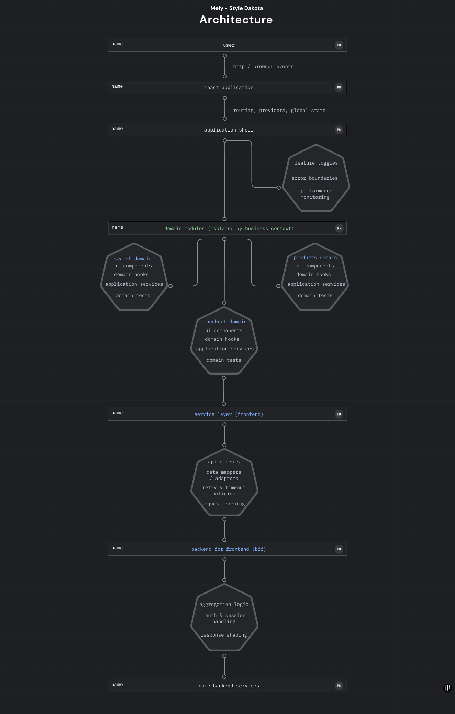

## Overview

This repository showcases an **enterprise-grade frontend architecture** built with React and TypeScript, inspired by patterns commonly used in large-scale platforms such as **Mercado Libre**.

The focus is not on visual complexity, but on **scalability, performance, maintainability, and developer experience**, reflecting real-world constraints found in high-traffic, multi-team environments.

This project is designed as a **technical verification artifact**, not a tutorial or demo.

---

## Architectural Principles

- Domain-driven frontend structure
- Strong separation of concerns
- Predictable data flow
- Performance-first mindset
- Testability by design
- Team scalability over individual speed

---

## Architecture Overview

This structure mirrors how frontend teams operate at scale, where multiple squads work independently on well-defined domains.

## Technology Stack

- React + TypeScript
- Modern Hooks-based architecture
- Code splitting & lazy loading
- Testing: Unit + E2E
- Performance optimizations aligned with real production scenarios

## Performance Strategy

- Route-based lazy loading
- Memoization of critical components
- Controlled re-renders
- Bundle size awareness
- Clear ownership of performance-sensitive code paths

## Testing Strategy

- Unit tests focused on business logic
- E2E tests covering user-critical flows
- Test isolation to support CI pipelines
- Designed to scale with team size

## Real-world Inspiration

This architecture is inspired by practices observed in:

- Large e-commerce platforms
- Multi-team frontend organizations
- High-traffic consumer-facing products

Patterns and decisions are aligned with environments such as Mercado Libre,
where performance, accessibility, and reliability are first-class concerns.

## Trade-offs & Decisions

- Prioritizes long-term maintainability over short-term delivery speed
- Introduces more structure than a typical small frontend project
- Slightly higher upfront complexity to enable multi-team scalability

## Why this repository exists

- Demonstrate senior-level frontend architecture
- Show decision-making beyond code syntax
- Reflect how real teams work in production
- Serve as a reference for enterprise frontend design

---

## Package Strategy

This repository is designed to be compatible with internal package
distribution strategies (GitHub Packages / private registries).

While no public package is published, the structure supports:
- Shared UI libraries
- Internal design systems
- Versioned frontend modules

---

```text
src/
 ├─ app/                 # App bootstrap, routing, providers
 ├─ modules/             # Domain-driven feature modules
 │   └─ products/
 │       ├─ components/
 │       ├─ hooks/
 │       ├─ services/
 │       ├─ types/
 │       └─ tests/
 ├─ shared/              # Cross-domain reusable components
 ├─ performance/         # Performance utilities and monitoring
 ├─ config/              # Environment and runtime configuration
 └─ tests/               # E2E and integration tests